# SCUT Online Bank Application 云计算课程设计文档

## 简要介绍 *Abstract*

`SCUT Online Bank Application` 是一个部署在 `IBM LinuxOne虚拟主机` 上、基于 `MEAN Stack` 架构、采用 `MVC` 模式快速开发的轻量级 `Bank Web App` ，实现了**开户、存取款、转账和购买理财产品**等基本功能。

## 业务分析 *Analayse*

### 用例图示 *Use Case*

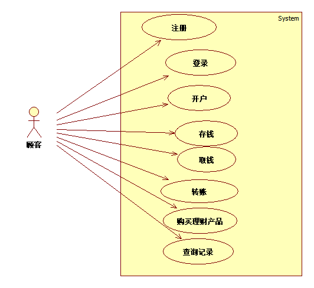

### 功能展示 *Features*

#### 登录界面

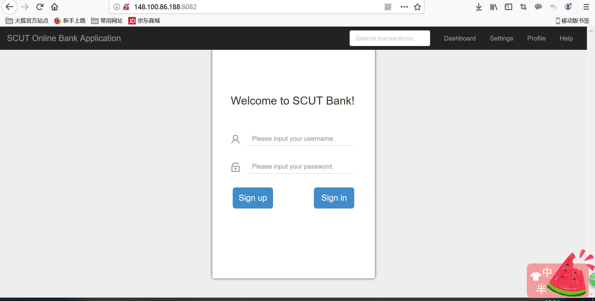  

#### 操作界面

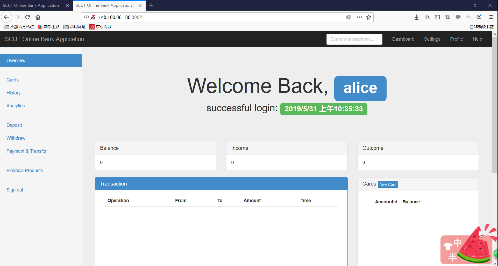  
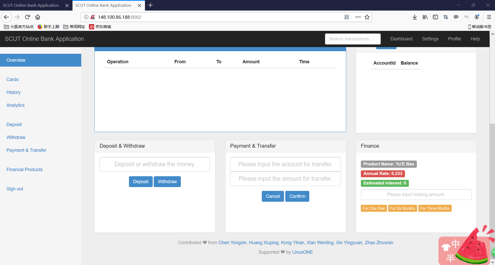  

#### 开户：新建账户

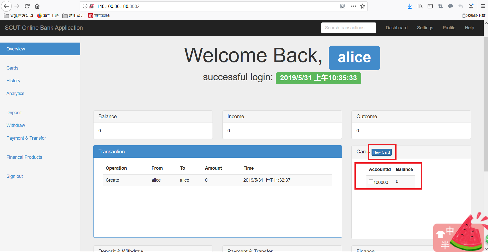  

- 每个账户的id都是唯一的标识，第一张卡的id从 `100000` 开始往后发放
- 每个账户的初始balance都为0

#### 存取款：存取入金额

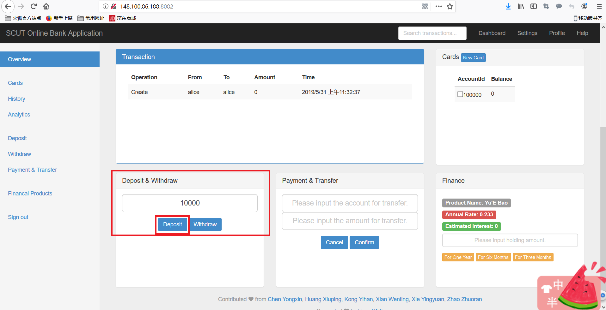  
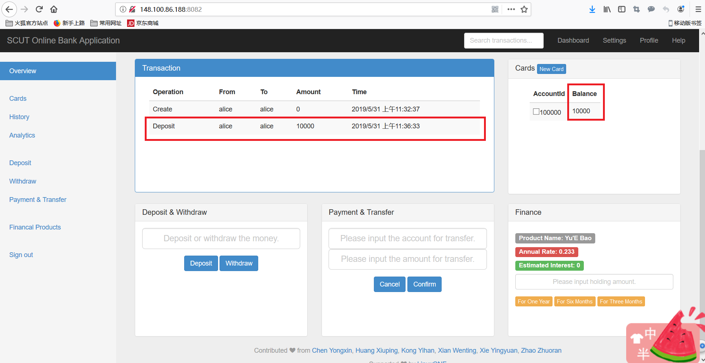  

- 存入金额时注意需要先选定一个账户
- 实现了对超额取款的错误处理提醒

#### 理财：购买理财产品

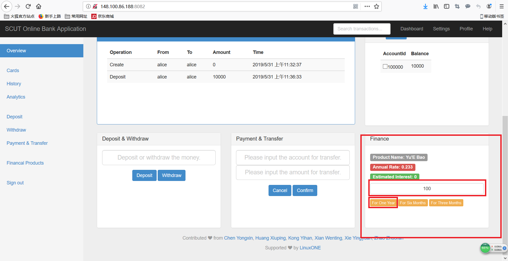  
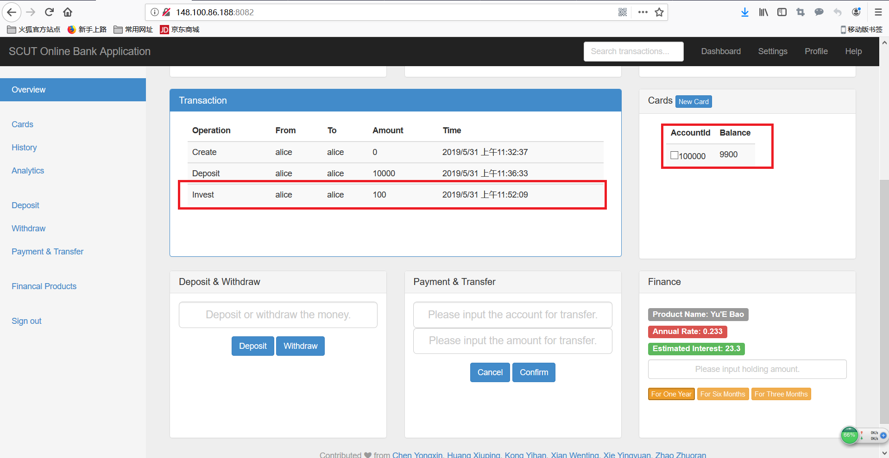  

- 提供持有金额和持有天数的选择
- 主要实现预计收益的计算

#### 转账：向不同账户转账

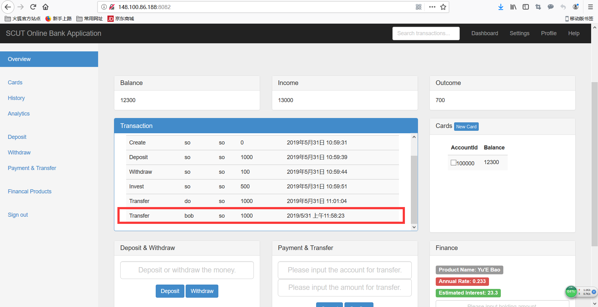  
  

- 转账是以账户对账户的方式，因为账户的id是它们唯一的标识
- 跨客户的转账应该在两个客户的交易记录中都添加显示

## 运行环境 *Development*

### 环境要求 *Environment*

- 装有Docker or docker-compose

### 安装指南 *Installation*

- **Docker**:

        $ cd [Dockerfile目录]
        $ docker build -t "repository:tag" ./
        $ docker run [Docker镜像文件]

- **docker-compose**:

        $ cd [docker-compose.yaml目录]
        $ docker-compose down
        $ docker rmi -f [[Docker镜像文件]]
        $ docker-compose up

## 技术选型 *Technology stack*

### MEAN全栈架构  *MEAN Stack*

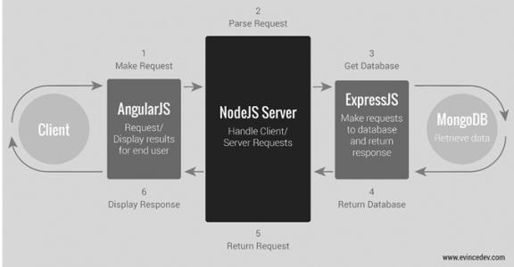

- **MongoDB**：MongoDB是一个使用JSON风格存储的数据库，解决数据存储问题
- **Express.js**：ExpressJS是一个Web应用框架，提供Route切换和HTTP与数据库交互的封装服务
- **Angular.js**：是一个前端MVC框架，提供前后端和数据库交互的统一框架
- **Node.js**：是一个并发、异步、事件驱动的Javascript服务器后端开发平台，提供和服务器交互的服务

### MVC文件目录 *MVC Dirs*

        mean-docker
        ├── docker-compose.yml              // Docker容器文件配置
        ├── express-server
        │   ├── app
        │   │   ├── models                  // 数据库关系模式
        │   │   │   ├── account.js
        │   │   │   ├── customer.js
        │   │   │   └── transaction.js
        │   │   └── routes.js               // HTTP请求更新数据库
        │   ├── config
        │   │   └── database.js
        │   ├── Dockerfile                  // Docker镜像文件配置
        │   ├── license
        │   ├── package.json
        │   ├── public
        │   │   ├── css                     // 前端样式
        │   │   │   ├── dashboard.css
        │   │   │   ├── reset.css
        │   │   │   ├── signin.css
        │   │   │   ├── style.css
        │   │   │   └── theme.css
        │   │   ├── img                     // 前端图片
        │   │   │   ├── bg.jpg
        │   │   │   ├── name.png
        │   │   │   └── password.png
        │   │   ├── index.html              // 前端界面
        │   │   └── js
        │   │       ├── controllers
        │   │       │   └── main.js         // 后端业务逻辑
        │   │       ├── core.js
        │   │       └── services            // 封装HTTP请求服务
        │   │           ├── accounts.js
        │   │           ├── customers.js
        │   │           └── transactions.js
        │   ├── README.md
        │   └── server.js
        ├── README.md
        └── test                            // 启动Web App服务批处理文件

### 前端 *Frontend*

技术栈 *Technology stack*:

1. **BootStrap**: 提供简洁美观的UI组件，开发速度快、成本低
2. **Angular.js**: 提供前后端的数据双向绑定，比如;
   1. `ng-model`: 前端数据传至后端
   2. `{{}}`: 后端数据传至前端
   3. `ng-click`: 前端组件绑定后端监听
3. **前端代码部分示意**：

        <!-- 欢迎语 -->
        

            <!-- 显示客户昵称 -->
            <h1>Welcome Back, {{ currCustomer.username }}</h1>
            <!-- 显示上次成功登陆时间 -->
            <h2>Last successful login: {{ currCustomer.lastSuccessfulLogin }}</h2>
        

### 后端 *Backend*

技术栈 *Technology stack*:

1. **Node.js**: 与服务器交互，解析JavaScript语言并处理HTTP请求
2. **Express.js**: 封装一些HTTP请求服务进行与数据库的交互，还提供路由转换等应用服务
3. **后端代码部分示意**：

        // controllers/main.js
        $scope.selectAccount = function(id) {
            Accounts.get().success(function(data){
                for(var idx in data){
                    if(data[idx]["_id"]==id){
                        console.log("获取到当前账户信息！");
                        console.log("matching id:"+data[idx]["_id"]);
                        $scope.currAccount=data[idx];
                        var msg = JSON.stringify($scope.currAccount);
                        console.log(msg);
                    }
                }
            })
        };

        // services/customer.js
        angular.module('customerService', [])
            .factory('Customers', ['$http',function($http) {
                return {
                    get : function() {
                        return $http.get('/api/customers');
                    },
                    create : function(customerData) {
                        return $http.post('/api/customers', customerData);
                    },
                    put : function(id, customerData) {
                        return $http.put('/api/customers/' + id, customerData);
                    },
                    delete : function(id) {
                        return $http.delete('/api/customers/' + id);
                    }
                }
            }]);

        // app/routes.js
        app.post('/api/transactions', function (req, res) {

            Transaction.create({
                operation: req.body.operation,
                from: req.body.from,
                to: req.body.to,
                amount: req.body.amount,
                time: req.body.time,
                done: false
            }, function (err, transaction) {
                if (err)
                    res.send(err);

                getTransactions(res);
            });

        });

### 数据库 *Database*

技术栈 *Technology stack*:

1. **MongoDB**: 非关系型数据库
2. **Mongoose**: Node.js环境下对mongodb进行便捷操作的对象模型工具
3. **关系模式部分示意**:

        // customer.js
        var mongoose = require('mongoose');

        // Define the Customer schema
        module.exports = mongoose.model('Customer', {
            username: {
                type: String,
                default: ''
            },
            password: {
                type: String,
                default: ''
            },
            accounts: [{
                type: String,
                default: ''
            }]
        });

        // account.js
        var mongoose = require('mongoose');

        // Define the Account schema
        module.exports = mongoose.model('Account', {
            customerName: {
                type: String,
                default: ''
            },
            accountId: {
                type: String,
                default: ''
            },
            balance: {
                type: Number,
                default: 0.0
            },
            income: {
                type: Number,
                default: 0.0
            },
            outcome: {
                type: Number,
                default: 0.0
            }
        });

        // transaction.js
        var mongoose = require('mongoose');

        // Define the Transaction schema
        module.exports = mongoose.model('Transaction', {
            account: {
                type: String,
                default: ''
            },
            operation: {
                type: String,
                default: ''
            },
            from: {
                type: String,
                default: ''
            },
            to: {
                type: String,
                default: ''
            },
            amount: {
                type: Number,
                default: 0.0
            },
            time: {
                type: Date,
                default: ''
            },
        });

## 团队分工 *Team Work*

| 任务编号 | 任务名称 | [chen201730681280](https://github.com/chen201730681280) | [LotteWong](https://github.com/LotteWong) | [KONG98](https://github.com/KONG98) | [prprprprbiu](https://github.com/prprprprbiu) | [sherele](https://github.com/sherele) | [Alice](https://github.com/zhao201730685110) |
| -------- | ------------ | ------ | ------ | ------ | ------ | ------ | ------ |
| A0       | 业务分析 | √    | √    | √    | √    | √    | √    |
| A1       | 前端设计 |        | √    |        |        | √    |        |
| A2       | 后端搭建 |        | √    | √    |        |        | √    |
| A3       | 数据库连接 | √    |        |        | √    |        |        |
| A4       | 测试集成打包 | √    |        |        | √    |        |        |
| A5       | 项目开发文档 |        | √    |        |        |        | √    |
| A6       | 项目演示文稿 |        |        | √    |        | √    |        |

## 未来工作 *Future Work*

- 扩展银行业务
- 前端界面美化
- 实现路由跳转
- 后端代码优化
- 数据库异步操作
